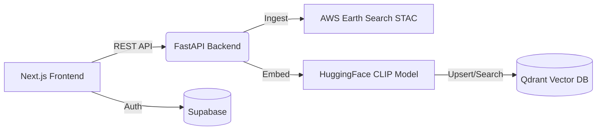

# SentinelAI: AI-Powered Satellite Imagery Intelligence


SentinelAI is a cutting-edge, open-source platform that brings natural language search and automated change detection to planetary-scale satellite imagery. By combining Vision-Language AI Models (CLIP) with high-performance vector databases, SentinelAI allows users to search the globe using just text and automatically detect structural changes (deforestation, urban sprawl, construction) over time.

---

## Key Features

- **Natural Language Search:** Type "lakes", "dense forest", or "new construction" to instantly find corresponding geographical features across entire cities.
- **Automated Satellite Ingestion:** Automatically downloads and processes cloud-free Sentinel-2 satellite data for *any city in the world* using AWS Earth Search STAC APIs.
- **AI Vector Embeddings:** Uses a specialized Remote Sensing Vision-Language Model (`clip-rsicd-v2`) to deeply understand and classify satellite patches.
- **Blazing Fast Vector DB:** Integrates with Qdrant Cloud to perform semantic similarity searches across millions of pixels in milliseconds.
- **Automated Change Detection:** Uses Structural Similarity (SSIM) and OpenCV Sub-Pixel Alignment (ECC) to detect macro-changes between temporal satellite pairs, instantly classifying them as "new construction", "deforestation", etc.
- **Interactive Geospatial Dashboard:** A beautiful, dark-themed Next.js frontend featuring MapLibre GL for rendering interactive bounding boxes and dynamic maps.
- **Secure Authentication:** Integrated with Supabase for secure user login and tracking search history.

---

## Architecture

SentinelAI is built on a highly modular, decoupled architecture:



### Tech Stack
- **Frontend:** Next.js (React), TailwindCSS, MapLibre GL, Supabase Auth.
- **Backend:** Python, FastAPI, HuggingFace Transformers, PyTorch, OpenCV, Rasterio.
- **Database:** Qdrant (Vector Data), Supabase PostgreSQL (Auth & History).

---

## Getting Started (Local Development)

### 1. Clone the Repository
```bash
git clone https://github.com/KoushalGH/SentinelAI.git
cd SentinelAI
```

### 2. Setup the Backend
Requires Python 3.10+
```bash
cd backend
python -m venv venv
source venv/bin/activate  # (On Windows use: venv\Scripts\activate)
pip install -r requirements.txt
```
Create a `.env` file in the `backend/` directory:
```env
QDRANT_URL=your_qdrant_cluster_url
QDRANT_API_KEY=your_qdrant_api_key
```
Run the FastAPI Server:
```bash
uvicorn main:app --reload
```

### 3. Setup the Frontend
Requires Node.js 18+
```bash
cd ../frontend
npm install
```
Create a `.env.local` file in the `frontend/` directory:
```env
NEXT_PUBLIC_SUPABASE_URL=your_supabase_url
NEXT_PUBLIC_SUPABASE_ANON_KEY=your_supabase_anon_key
NEXT_PUBLIC_BACKEND_URL=http://localhost:8000
```
Run the Next.js Server:
```bash
npm run dev
```

---

## Contributing
Contributions, issues, and feature requests are welcome! Feel free to check the issues page.

## License
This project is open-source and available under the MIT License.
